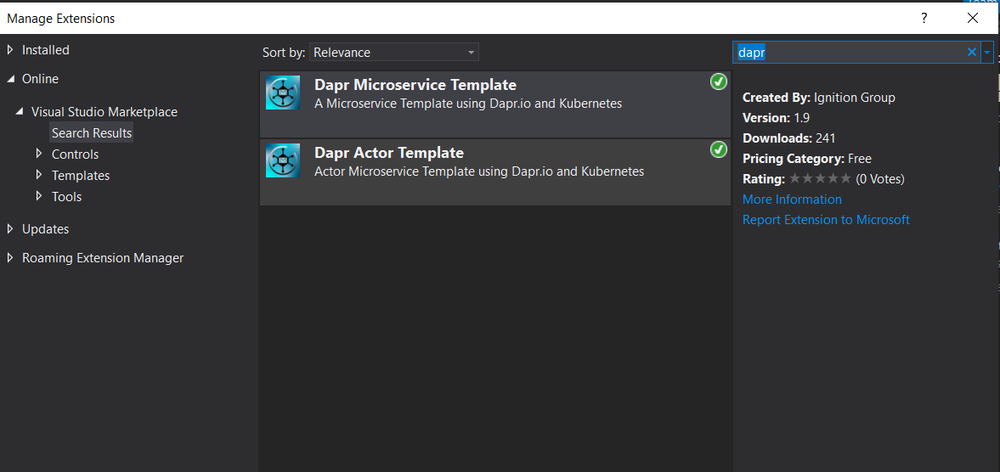
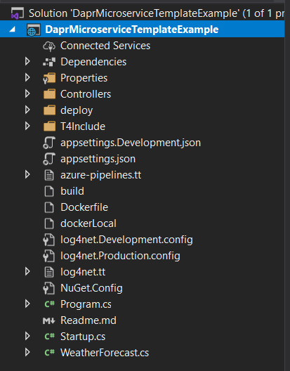

# Dapr-Microservice-Template
A Microservice Template for visual studio using Dapr.io and Kubernetes

### Introduction ###
This VS template makes it easy to create microservices that can be deployed as Dapr applications into a Kubernetes Cluster.
Includes a .VSIX project to create a VS Extention installer.

Available from the Visual Studio Marketplace : https://marketplace.visualstudio.com/items?itemName=IgnitionGroup.DaprMicroService

### Prerequisites
* Visual Studio 2019
* .NET Core 3.1

## Getting Started
Install the Dapr microservice template from the link above.
Once installed click on Extensions -> Manage Extensions from the menu in visual Studio.
Under installed extentions you should find the Extension Installed. 

To create a new project in visual studio using the template
* Add a new project by selecting File -> New Project.
* Select Dapr Microservice Template for the project type and fill in the project information. Click on Create
* A custom prompt will ask for the microservice application name to be used by the Dapr on deployment into the Kubernetes cluster.

The information captured in the customer prompt will replace the template variables in the yaml files found in the project.

*annotations:
        dapr.io/enabled: "true"
        dapr.io/id: "$daprAppName$"
        dapr.io/port: 3000*

A new project will be created as below

## DaprMicroserviceTemplate project ##

  
Building a Docker Image

  
DockerFile - Contains the commands to build a Docker image for the microservice.

  
YAML Files

  
T4 Templating - Deployment files are generated using T4 template. See Data.txt for settings.
  
DeployDev.yaml - For development - Contains the information for deployment into a dev/Test kubernetes cluster

  
DeployProd.yaml - For Production - Contains the information for deployment into a production kubernetes cluster

  
Azure-Pipelines.yaml - File used to Create the microservice Deployment pipeline for Micrsoft Azure Dev Ops

  
Custom Nuget Sources

  
Nuget.config - Add any additional package sources to this file. Required to build the docker image correctly using dot net Restore.

  
Log4Net Logging

  
Log4Net.config - This template uses Log4net for logging. Contains a console and Gelf4Net.UdpAppender logger. Development and Production files generated by T4 template 

  
Open Api (Swagger) Support

  
Swagger is a set of open-source tools built around the OpenAPI Specification that can help you design, build, document and consume REST APIs

        
Api Reponse Wrapper

        
 Uses AutoWrapper.Core for a consistent api response format across microservices :https://github.com/proudmonkey/AutoWrapper

## TemplateInstaller - VSIX Project ##

This project will create a .VSIX installer for the Microservice Template. 

## License

This project is licensed under the MIT License - see the [LICENSE.md](LICENSE.md) file for details
